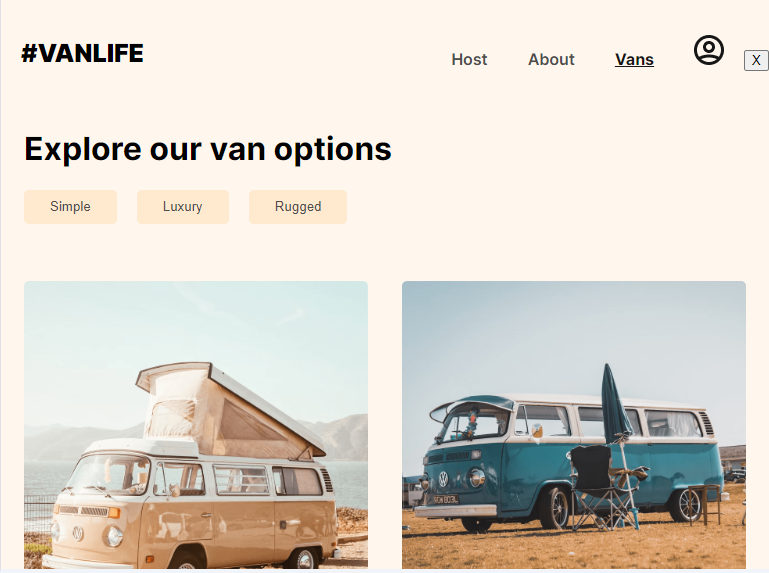

React JS Vanlife app 

## Optimizations
- That displays Vans data 
- From an In build API 
- Build with React Routers 
- Get Data from FireStore 
- Store some Data on LocalStorage
- Authentication Require.

## Lessons Learned:

- What are SPAs?
- Basic router setup
- Route
- Link
- Route parameters
- Nested routes and Outlet
- Layout and Index routes
- Relative paths
- NavLink
- Outlet context
- Search parameters
- Link state
- 404 page / Splat routes
- Loaders
- Actions
- Form & form data
- defer()
- Await
- Suspense
- Error handling & errorElement
- useRouteError
- useNavigate
- useNavigation
- useLocation
- useLoaderData
- useActionData
- Protected Routes 

